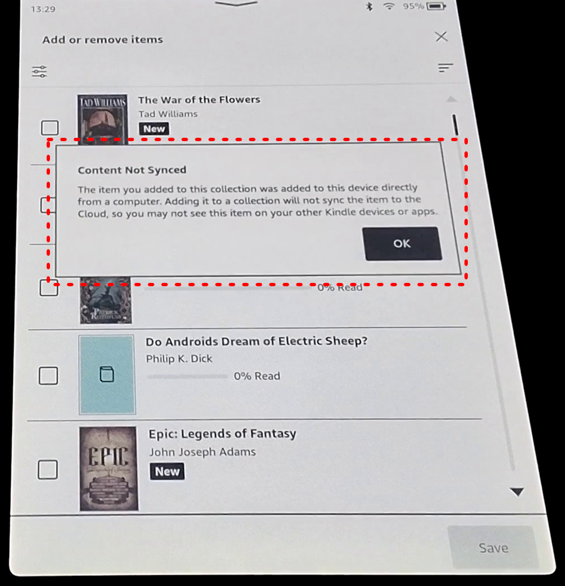

# KPP Patch

> [!CAUTION]
> Patching the KPP app can effectively brick your Kindle. Before you attempt
> it, you should have set up SSH in your Kindle, enabled it to run on boot, as
> well as double checked that you can SSH through the USB port during boot. If
> the patched KPP has an error, the app will fail to launch and the Kindle
> will just display a blank screen. Having SSH configured will enable you to
> restore the unpatched KPP app.

> [!IMPORTANT]
> Extracting and replacing the KPP app requires a jailbroken Kindle.

Since [5.14.2 (February 2022)][5.14.2 release] the Kindles run a new
homepage application made with React Native, replacing the older Java
application and UI.

This new homepage app, KPP (likely Kindle Plus Plus), makes use of the
[Hermes engine][], which means that if we want to patch or edit the app in any
way, we need to disassemble the Hermes bytecode, edit it, reassemble it, and
then replace the app in the target Kindle.

KPP Patch will take care of patching the KPP app, refusing to do so if
the file is not as expected, as sometimes different versions might break
patches.


## Extracting the file

The KPP app can be found in your Kindle under
`/app/KPPMainApp/js/KPPMainApp.js.hbc`. Copying it can be done with the system
mounted as read-only (the default), but replacing it will require mounting the
filesystem for read-write. It is recommended you set the filesystem back to
read-only after replacing the KPP app with the patched one.


## Usage

You can use `uv`, `pyenv`, or whatever other Python management tool you're
comfortable with to manage the dependencies. Here I'll just assume basic
`pip` usage. For copying the file from/to the Kindle I'll assume SSH:

```bash
# Install project dependencies
$ pip install .

# Copy the file from your Kindle, IP will likely vary
$ scp root@192.168.15.244:/app/KPPMainApp/js/KPPMainApp.js.hbc .

# Patch the app with selected patches
# The original file won't be modified, instead the patched file
# will have a .patched suffix
$ python main.py KPPMainApp.js.hbc

$ file KPPMainApp.js.hbc.patched 
dump/KPPMainApp.js.hbc.patched: Hermes JavaScript bytecode, version 84

# To copy it back into the Kindle, you'll need to temporarly enable write
$ ssh root@192.168.15.244
[root@kindle root]$ mntroot rw
[root@kindle root]$ exit

$ scp KPPMainApp.js.hbc.patched root@192.168.15.244:/app/KPPMainApp/js/KPPMainApp.js.hbc

# Remember to re-enable the read-only filesystem again
$ ssh root@192.168.15.244
[root@kindle root]$ mntroot ro
[root@kindle root]$ exit
```

### Selecting patches

By default when you run KPP Patch, it will drop you in a `curses` window where
you can interactively select which patches you want to apply. By default no
patches are selected.

The original file won't be overwritten, and instead a file with the suffix
`.patched` will be created in the same directory as the input file.

If your environment doesn't support curses, or you prefer a purely CLI
interface, you can disable the curses TUI by passing `--no-interactive`. This
will allow you to select patches by passing `--patch_*` flags through the
command line. Run `--help` to get the most up-to-date list of existing
patches.

## Current CLI help

> [!NOTE]
> This might not always be up to date. Run `--help` yourself to get the most
> accurate information.

<!--CH0-->
```
usage: kpp_patcher [-h] [--interactive | --no-interactive] [--patch_collection_not_synced_popup] [--patch_homepage] [--patch_registration_detection]
                   [--patch_store_button]
                   filename

Patch different behaviours of the Kindle KPP app

positional arguments:
  filename              Path to the KPPMainApp.js.hbc file

options:
  -h, --help            show this help message and exit
  --interactive, --no-interactive
                        Use interactive mode to select patches. If this option is set, cli choices are ignored. Disable with --no-interactive.
  --patch_collection_not_synced_popup
                        Patch out the not synced popup when adding sideloaded content to collections. When adding sideloaded content to collections, it will show a
                        popup telling you that the content is not synced. This patch removes that popup. See docs/patch_collection_not_synced_popup.jpg
  --patch_homepage      Patch out homepage "Discover Books" carousels. Kindles have ads for unrelated Amazon store books that show up in the home page. This patch
                        will remove those ad rows. NOTE: Might not work or might delete too much in certain devices. Confirmed not working on a PW5 with 5.16.2.1.1
                        See docs/patch_homepage.jpg
  --patch_registration_detection
                        Patch out the Clould Not Available popup. This popup is very common on unregistered devices. Newer devices/firmwares require a registration
                        to use, and while jailbreaks allow us to bypass this, this popup will always show when navigating to the home page. See
                        docs/patch_registration_detection.jpg
  --patch_store_button  Patch out the store button. See docs/patch_store_button.jpg
```
<!--CH1-->

## Current patches

> [!NOTE]
> This might not always be up to date. Run `--help` yourself to get the most
> accurate information.

<!--CP0-->
### patch_collection_not_synced_popup

Patch out the not synced popup when adding sideloaded content to collections.

When adding sideloaded content to collections, it will show a popup telling
you that the content is not synced. This patch removes that popup.




### patch_homepage

Patch out homepage "Discover Books" carousels.

Kindles have ads for unrelated Amazon store books that show up in the home
page. This patch will remove those ad rows.

NOTE: Might not work or might delete too much in certain devices. Confirmed
not working on a PW5 with 5.16.2.1.1


### patch_registration_detection

Patch out the Clould Not Available popup.

This popup is very common on unregistered devices. Newer devices/firmwares
require a registration to use, and while jailbreaks allow us to bypass this,
this popup will always show when navigating to the home page.


### patch_store_button

Patch out the store button.


<!--CP1-->


[5.14.2 release]: https://blog.the-ebook-reader.com/2022/02/09/kindle-software-update-5-14-2-released/
[Hermes engine]: https://reactnative.dev/docs/hermes
